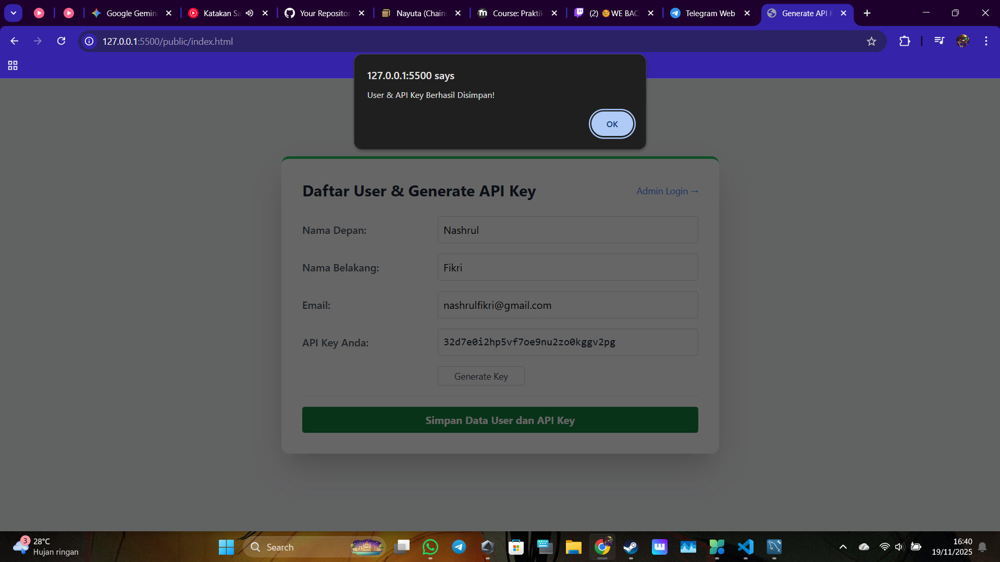
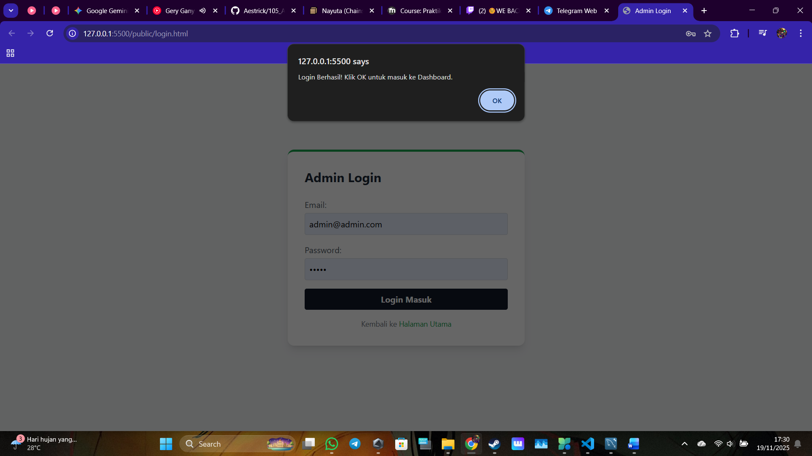
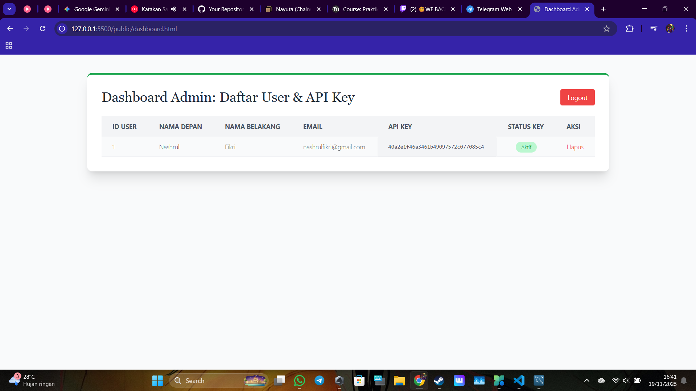
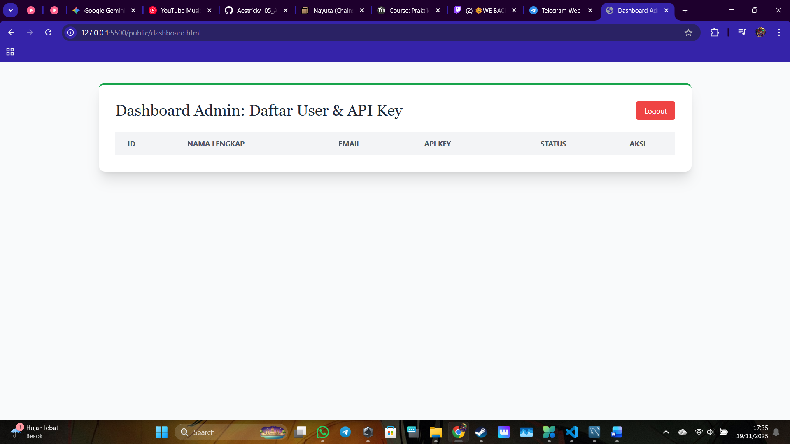
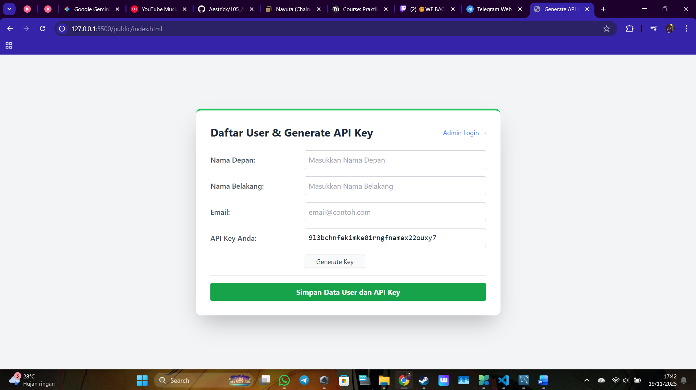

# Praktikum 6: Fullstack API Key Generator

Proyek ini adalah aplikasi web sederhana untuk manajemen API Key. User dapat mendaftarkan diri untuk mendapatkan API Key secara otomatis, dan Admin dapat melihat serta mengelola daftar user melalui dashboard.

## 🛠️ Fitur Utama

1.  **User Registration & Auto-Generate Key:**
    * User mengisi data diri.
    * Sistem otomatis membuat API Key unik (32 karakter hex) menggunakan `crypto`.
    * **Fitur Spesial:** Setiap kali registrasi baru dilakukan, sistem akan selalu menghasilkan kombinasi kunci yang baru dan berbeda (Randomized).

2.  **Admin Authentication:**
    * Login khusus admin dengan validasi email & password.
    * Menggunakan alert notifikasi saat login berhasil.

3.  **Admin Dashboard:**
    * Menampilkan tabel seluruh user.
    * Fitur untuk memantau dan menghapus data user/API Key yang sudah tidak digunakan.

---

## 📸 Dokumentasi Aplikasi

Berikut adalah bukti tampilan dan fungsionalitas aplikasi.

### 1. Halaman Register & Generate Key
Tampilan form dimana user mengisi data. API Key muncul otomatis setelah tombol Generate diklik.

### 2. Halaman Login Admin (Dengan Notifikasi)
Halaman masuk administrator. Jika login sukses, akan muncul **Pop-up Alert** sebelum diarahkan ke dashboard.

### 3. Dashboard Admin (Data Masuk)
Tampilan tabel admin yang berisi data user yang baru saja mendaftar.

### 4. Manajemen Data (Hapus User)
Tampilan dashboard setelah Admin melakukan penghapusan data user (API Key dicabut dari database).

### 5. Bukti Generate API Key Unik (Berkali-kali)
Bukti bahwa sistem mampu men-generate API Key yang berbeda-beda setiap kali ada permintaan baru. 
Gambar di bawah menunjukkan percobaan generate yang menghasilkan kunci unik yang berbeda.

